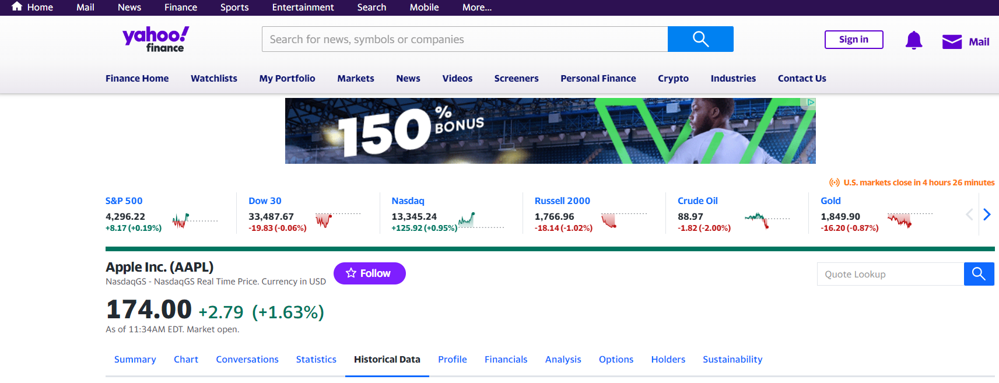
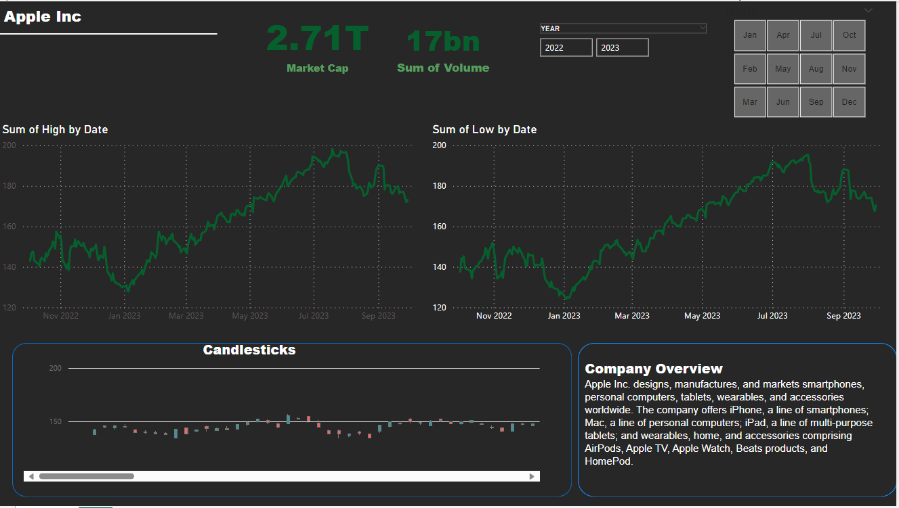

# Apple-Stock-Market-Dashborad

## Introduction
This is a power Bi project on Apple Inc Stock Market From October 2022 to september 2023. 
This project is to analyze and derive insight to answer crucial questions and help the client make data driven decisions.

## Problem statement
1. What is the market Captial of Apple Inc
2. The sum of the market High and Low price over the period of the given year
3. Total Revenue Generated

## Skills/ concept demonstrated

The following power Bi features were incorporated
- Dax, 
- new table,
- modelling

## Modelling
The data was gotten from yahoo finance, which was then transfed in power Bi for analyzation.

You can interact with the report [here](https://github.com/Tiwaloluwafasetire/Apple-Stock-Market-Dashborad/blob/main/Apple%20Inc.pbix)

